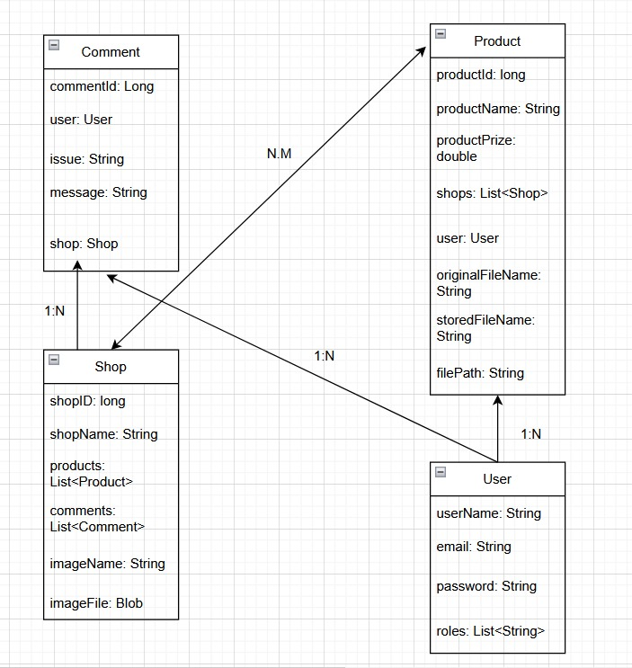

# 📘 INDIETOX - Grupo r6

<h3>Indietox es una página web de ropa en la que contenemos varias tiendas, cada una con sus productos propios pudiendo añadir comentarios con las opiniones de los clientes.<h3>
---

## 👥 Integrantes del Equipo de Desarrollo

| Nombre y Apellidos   | Correo Universidad              | Usuario GitHub |
|----------------------|---------------------------------|----------------|
| Adrian Alvarez Diez  | a.alvarezd.2021@alumnos.urjc.es | [adrianAD1]    |
| Adrian Muñoz Jimenez | a.munozj.2021@alumnos.urjc.es   | [adrimj09]     |
| Aitor Garcia Ceruelo | a.garciace.2021@alumnos.urjc.es | [Mageitor]     |

---

### 📌 Entidades

La aplicación gestiona las siguientes entidades principales:

- **User**: Representa usuario con roles, en función de este tiene unos permisos u otros para realizar acciones sobre otras entidades.
- **Shop**: Representa tiendas de ropas a las que pertenecen distintos productos que estan a la venta.
- **Comment**: Representa la opinión de los usuarios respecto a una tienda o sus productos.
- **Product**: Estan dentro de una tienda y es la ropa que se puede comprar.

### Relaciones

Las entidades tienen relaciones entre ellas, a continuación se muestra:

- Un **usuario** puede comprar varios **productos**.
- Un **usuario** puede tener varios **comentarios**.
- Un **comentario** esta asociado a un solo **usuario**.
- Un **comentario** pertenece a una **tienda**.
- Una **tienda** tiene varios **productos** y varios **comentarios**.
- Un **producto** puede pertenecer a varias **tiendas**.
- Un **producto** pertenece a un **usuario**.

### 🔐 Permisos de los Usuarios

| Tipo de Usuario           | Permisos                                                                                                                        |
|---------------------------|---------------------------------------------------------------------------------------------------------------------------------|
| **Administrador**         | Gestión completa de todas las entidades.                                                                                        |
| **Usuario registrado**    | Crear, editar y eliminar algunas entidades de las que sea dueño, como comentarios, y poder ver y añadir productos a su carrito. | 
| **Usuario no registrado** | Solo pueden ver tiendas y productos.                                                                                            | 

### 🖼️ Imágenes Asociadas

- **Tienda** es la entidad que cuenta con una imagen asociada.

## 🗂️ Diagrama de Entidades de la Base de Datos

A continuación se muestra el diagrama entidad-relación o UML correspondiente:

---

## 🤝 Desarrollo Colaborativo

### 👤 Miembro: Adrian Alvarez Diez

#### 📄 Tareas Realizadas

Implementacion de varios aspectos de seguridad como sanitizacion, configuracion de seguridad y uso de usuario, y colaboracion en distintos procesos de otros miembros.

#### ✅ Commits Más Significativos

1. [Commit 1] Implementacion de sanitizacion
2. [Commit 2] Modificacion rutas de security config
3. [Commit 3] Proteccion de contraseñas de usuario
4. [Commit 4] Creacion carpeta jwt y modificacion de usuario para el login
5. [Commit 5] Implementacion de rest controllers

#### 🗃️ Archivos con Mayor Participación

1. SanitizationService.java
2. SecutiryConfig.java
3. User.java
4. shop.java
5. UserRestController.java

---
### 👤 Miembro: Adrian Muñoz Jimenez

#### 📄 Tareas Realizadas
Resolucion de problemas e incorporacion de manejo de excepciones y nuevas funcionalidades a la web, ademas de colaboracion con los demas miembros.

#### ✅ Commits Más Significativos

1. [Commit 1] Añadir fichero en disco
2. [Commit 2] Añadir campo de texto enriquecido
3. [Commit 3] Paginacion
4. [Commit 4] Consulta dinamica
5. [Commit 5] Creacion de DTOs

#### 🗃️ Archivos con Mayor Participación

1. enriquecido.js
2. paginacion.js
3. fileStorageService.java
4. productService.java
5. webExceptionHandler.java

---
### 👤 Miembro: Aitor Garcia Ceruelo

#### 📄 Tareas Realizadas

Implementacion de login y registro, funcionalidades del usuario y modificacion html, y colaboracion con los demas miembros.

#### ✅ Commits Más Significativos

1. [Commit 1] Cambio a HTTPS
2. [Commit 2] Creacion de login y registro
3. [Commit 3] Listado de usuarios y funcionalidad de borrado para el admin
4. [Commit 4] Consulta, editar y eliminar usuario propio
5. [Commit 5] Arreglo de tokens

#### 🗃️ Archivos con Mayor Participación

1. userController.java
2. loginController.java
3. User.java
4. UserModelAttributes.java
5. login.html

---

